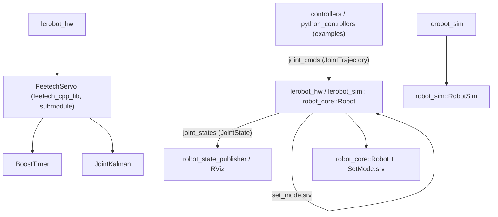

# EduBot Wiki

EduBot is a library of drivers, visualization tools and a simple simulation for
educational robot manipulators, built on top of the
[ROS 2](https://docs.ros.org/en/humble/index.html) middleware. The default target
is the [LeRobot SO-ARM100](https://github.com/huggingface/lerobot) arm; the
[Lynxmotion AL5A](https://wiki.lynxmotion.com/info/wiki/lynxmotion/view/servo-erector-set-robots-kits/ses-v1-robots/ses-v1-arms/al5a/)
is supported for legacy reasons in its own branch.

This wiki explains how the code and configuration work, so you can run the robot,
understand the architecture, and write your own controllers.

## Architecture at a glance

## Table of contents

### Getting started

- [Installation](installation.md) - prerequisites, ROS 2 Humble/Jazzy, cloning the repo (with submodules), USB access.
- [Building and running](building-and-running.md) - compiling with `colcon`, sourcing, updating, and the full list of launch files and runnable controllers.

### Understanding the code

- [Architecture](architecture.md) - the packages, how they layer, and the data flow between nodes.
- [Feetech servo driver](feetech-driver.md) - the `feetech_cpp_lib` low-level driver, serial protocol, Kalman filter, and control loop.
- [ROS interface](ros-interface.md) - the `robot_core::Robot` base class and the `joint_cmds` / `joint_states` / `set_mode` contract every controller uses.
- [LeRobot nodes](lerobot-nodes.md) - the `lerobot_hw`, `lerobot_read`, `lerobot_sim`, and `path_publisher` nodes.
- [Configuration](configuration.md) - every parameter in the YAML config files and how to customize the home position.
- [Simulation and visualization](simulation-and-visualization.md) - the simulator, RViz, the joint slider, the URDF model, and the mesh export script.

### Doing your own work

- [Writing controllers](writing-controllers.md) - the C++ and Python controller patterns and how to add your own.
- [Fork workflow](fork-workflow.md) - how to fork the repo, do your assignments, and stay in sync with upstream.

### Help

- [Troubleshooting](troubleshooting.md) - common problems (BRLTTY, baud/USB port, WSL, virtual machines) and where to report issues.

---

Found a bug? Please open an issue on the
[Issues](https://github.com/BioMorphic-Intelligence-Lab/edubot/issues) tracker
with a short description and steps to reproduce.
