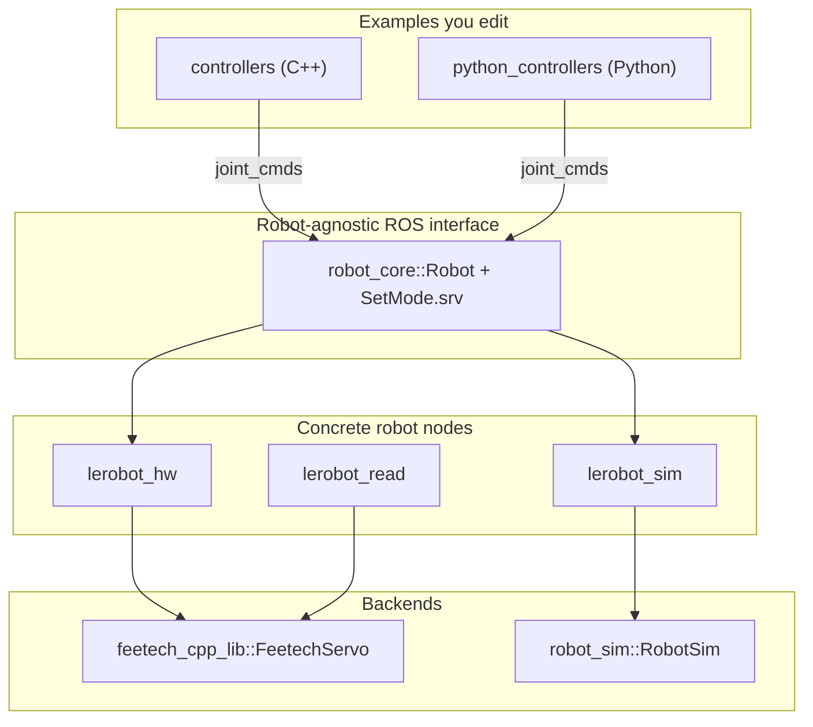
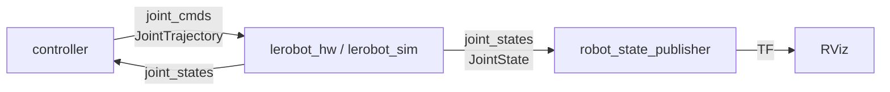
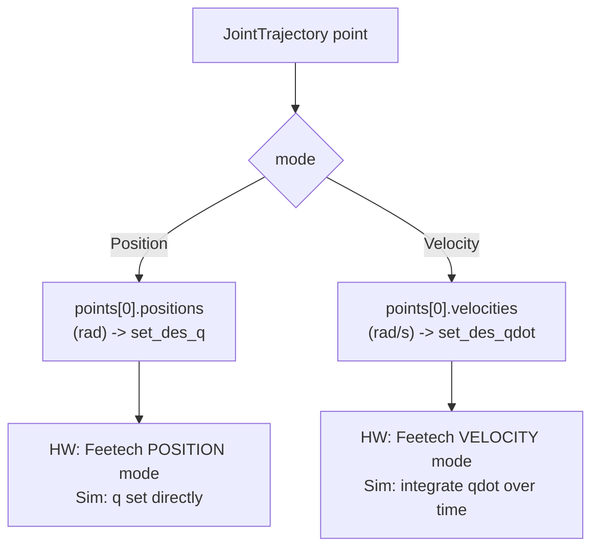

# Architecture

Back to [Home](Home.md)

EduBot is organized as a stack of ROS 2 packages. Lower layers talk to the
hardware; higher layers expose a clean, robot-agnostic ROS interface that your
controllers use. The same interface is shared by the real robot and the
simulation, so a controller written against it works in both.

## Package map

| Package | Location | Role |
|---------|----------|------|
| `feetech_cpp_lib` | [`ros_ws/src/feetech_cpp_lib`](../ros_ws/src/feetech_cpp_lib) | Low-level C++ driver for Feetech STS/SCS servos over serial. A git submodule. Built as a library. See [Feetech driver](feetech-driver.md). |
| `robot_core` | [`ros_ws/src/robot_core`](../ros_ws/src/robot_core) | Abstract `Robot` ROS 2 node base class + the `SetMode` service. Defines the common ROS interface. See [ROS interface](ros-interface.md). |
| `robot_sim` | [`ros_ws/src/robot_sim`](../ros_ws/src/robot_sim) | Reusable kinematic simulator library (`RobotSim`), a subclass of `Robot`. |
| `lerobot` | [`ros_ws/src/lerobot`](../ros_ws/src/lerobot) | The concrete LeRobot nodes: hardware driver, read-only node, simulation node, path publisher, plus launch files, URDF, meshes and config. See [LeRobot nodes](lerobot-nodes.md). |
| `controllers` | [`ros_ws/src/controllers`](../ros_ws/src/controllers) | C++ example controllers. See [Writing controllers](writing-controllers.md). |
| `python_controllers` | [`ros_ws/src/python_controllers`](../ros_ws/src/python_controllers) | Python example controllers. |

## How the packages layer

- `robot_core::Robot` is an abstract `rclcpp::Node`. It owns the ROS graph
  wiring (topics + the `set_mode` service) and routes commands to pure-virtual
  actuation methods.
- `lerobot_hw` implements those methods by talking to `FeetechServo`.
- `lerobot_sim` implements them through `robot_sim::RobotSim`, which integrates a
  simple kinematic model.
- Because both inherit the same base, a controller does not care whether it is
  driving real hardware or the simulation.

## Data flow in a typical session

The full contract (topic names, message types, units, joint order) is documented
on the [ROS interface](ros-interface.md) page. In short:

- Controllers **publish** `joint_cmds` (`trajectory_msgs/JointTrajectory`).
- Robot nodes **publish** `joint_states` (`sensor_msgs/JointState`).
- `robot_state_publisher` turns joint states into TF frames for RViz, using the
  [URDF](simulation-and-visualization.md#urdf-model).

## Position vs velocity control

The robot runs in one of two modes, selected at launch time (or via the
`set_mode` service):

- In **position mode** a command sets absolute joint angles.
- In **velocity mode** a command sets joint speeds; the simulator integrates them
  over time, and the hardware driver runs the servos in velocity mode.

The example controllers come in matching position and velocity variants - run the
one that matches the mode your robot/sim node was launched in. See
[Writing controllers](writing-controllers.md).
