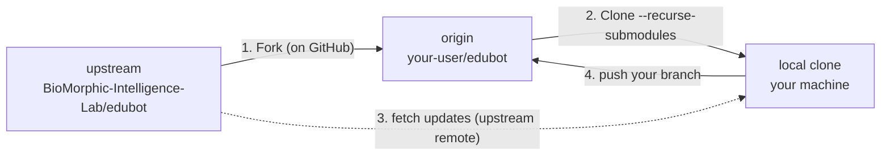

# Fork workflow (for students)

Back to [Home](Home.md)

If you are working on an assignment, the recommended workflow is to **fork** the
EduBot repository to your own GitHub account, do your work there, and periodically
pull in updates from the original ("upstream") repository. This keeps your work
separate while letting you stay up to date with fixes and new features.

This page walks through that workflow. It assumes you have already read
[Installation](installation.md), in particular the note that
[`feetech_cpp_lib`](feetech-driver.md) is a **git submodule**.

## How forks relate to upstream



You end up with two remotes in your local clone:

- `origin` -> your fork (you can push here).
- `upstream` -> the original repo (read-only; you pull updates from it).

## 1. Fork on GitHub

On the [EduBot repository](https://github.com/BioMorphic-Intelligence-Lab/edubot)
page, click **Fork** (top right) to create a copy under your own account, e.g.
`https://github.com/<your-user>/edubot`.

## 2. Clone your fork (with submodules)

Clone **your fork**, not the original, and clone recursively so the
`feetech_cpp_lib` submodule is fetched too:

```bash
git clone --recurse-submodules https://github.com/<your-user>/edubot
cd edubot
```

## 3. Add the upstream remote

Point a second remote at the original repository so you can pull in updates later:

```bash
git remote add upstream https://github.com/BioMorphic-Intelligence-Lab/edubot
git remote -v   # origin = your fork, upstream = original
```

## 4. Create a branch for your work

Keep `main` clean and do your assignment on a dedicated branch:

```bash
git checkout -b my-assignment
```

Then write your code (for example, a new controller - see
[Writing controllers](writing-controllers.md)), build, and commit:

```bash
git add .
git commit -m "Add my assignment controller"
git push -u origin my-assignment
```

## 5. Stay in sync with upstream

Every so often, pull the latest changes from upstream into your branch. Because
the project uses a submodule, update it afterwards as well:

```bash
# Get the latest upstream history
git fetch upstream

# Bring upstream/main into your current branch
git merge upstream/main        # or: git rebase upstream/main

# Update the feetech_cpp_lib submodule to the committed revision
git submodule update --recursive

# Rebuild after pulling changes
cd ros_ws && colcon build && cd ..

# Push the synced branch back to your fork
git push origin my-assignment
```

> If you prefer, keep your fork's `main` in sync with upstream and branch off it:
> `git checkout main && git fetch upstream && git merge upstream/main && git push origin main`.

## 6. (Optional) Contribute back with a Pull Request

If your change is useful for everyone, open a Pull Request from your branch on
your fork against `BioMorphic-Intelligence-Lab/edubot:main` on GitHub. Describe
what you changed and how to test it.

## Command cheat-sheet

| Goal | Command |
|------|---------|
| Clone your fork with submodule | `git clone --recurse-submodules https://github.com/<you>/edubot` |
| Add upstream remote | `git remote add upstream https://github.com/BioMorphic-Intelligence-Lab/edubot` |
| New work branch | `git checkout -b my-assignment` |
| Commit + push | `git add . && git commit -m "..." && git push -u origin my-assignment` |
| Fetch upstream | `git fetch upstream` |
| Merge upstream into branch | `git merge upstream/main` |
| Update submodule | `git submodule update --recursive` |
| If you forgot `--recurse-submodules` | `git submodule update --init --recursive` |

See [Building and running](building-and-running.md#updating) for the plain
(non-fork) update steps.
