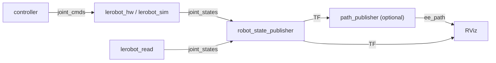

# LeRobot nodes

Back to [Home](Home.md)

The [`lerobot`](../ros_ws/src/lerobot) package contains the concrete ROS 2 nodes
for the LeRobot arm. The control nodes (`lerobot_hw`, `lerobot_sim`) inherit from
[`robot_core::Robot`](ros-interface.md), so they share the common
`joint_cmds` / `joint_states` / `set_mode` interface. `lerobot_read` and
`path_publisher` are standalone nodes.

For how to start these, see [Building and running](building-and-running.md). For
the parameter values they load, see [Configuration](configuration.md).

## `lerobot_hw` - real hardware driver

Files:
[`src/lerobot_hw.cpp`](../ros_ws/src/lerobot/src/lerobot_hw.cpp),
[`include/lerobot/lerobot_hw.hpp`](../ros_ws/src/lerobot/include/lerobot/lerobot_hw.hpp).

The Feetech servo driver node for the physical arm (5 DOF + gripper). It inherits
`Robot` and drives the hardware through
[`FeetechServo`](feetech-driver.md). On startup it connects to the serial bus,
applies the zero ticks, homes to `home_position`, closes the gripper, waits until
the joints reach home, then switches the Feetech operating mode.

- **Subscribes:** `joint_cmds` (`trajectory_msgs/JointTrajectory`)
- **Publishes:** `joint_states` (`sensor_msgs/JointState`), including `effort`
  (motor current used as an effort proxy)
- **Feedback:** `get_q`, `get_qdot`, `get_effort`, each with `joint_signs` applied

Mode behavior:

- **Position:** `setReferencePosition` -> Feetech position mode.
- **Velocity:** `setReferenceVelocity` -> Feetech velocity mode.

> Note: the driver mode is configured once at startup from the `mode` parameter.
> `LeRobotHW` does not re-wire the `set_mode` service to reconfigure the Feetech
> driver, so a runtime `set_mode` call flips the base-class enum but does not
> reconfigure the servos. Use the matching launch file to choose the mode.

Parameters (beyond the [base `Robot` params](ros-interface.md#base-parameters)):
`serial_port`, `baud_rate`, `frequency`, `gripper_open`, `gripper_closed`,
`max_speed`, `zero_positions`, `ids`, `joint_signs`, `home_position`. All are
documented in [Configuration](configuration.md#robot_hwyaml).

## `lerobot_read` - passive read-only node

Files:
[`src/lerobot_read.cpp`](../ros_ws/src/lerobot/src/lerobot_read.cpp),
[`include/lerobot/lerobot_read.hpp`](../ros_ws/src/lerobot/include/lerobot/lerobot_read.hpp).

A publish-only node that reads joint states with **torque disabled**
(`DriverMode::UNPOWERED`). Use it for hand-guiding / calibration: you can move the
robot by hand and observe the joint states.

- **Publishes:** `joint_states` (`sensor_msgs/JointState`)
- **No command topic, no control modes.**
- Joint names are hardcoded: `Shoulder_Rotation`, `Shoulder_Pitch`, `Elbow`,
  `Wrist_Pitch`, `Wrist_Roll`, `Gripper`.

Parameters: `serial_port`, `baud_rate`, `frequency`, `zero_positions`, `ids`,
`joint_signs` (see [Configuration](configuration.md#robot_readyaml)).

## `lerobot_sim` - simulation node

Files:
[`src/lerobot_sim.cpp`](../ros_ws/src/lerobot/src/lerobot_sim.cpp),
[`include/lerobot/lerobot_sim.hpp`](../ros_ws/src/lerobot/include/lerobot/lerobot_sim.hpp).

A thin LeRobot-specific subclass of `robot_sim::RobotSim` (which is itself a
`Robot` subclass). It sets the joint names, loads `home_position`, homes the arm,
and closes the gripper on startup. All ROS I/O comes from the `Robot` base class,
and the mode-dependent motion (instant in position mode, integrated in velocity
mode) is handled by `RobotSim`. See
[Simulation and visualization](simulation-and-visualization.md#the-robot_sim-backend).

- Declares the `home_position` parameter; inherits `mode`, `f`, `pub_topic`,
  `sub_topic` from `Robot` via YAML.

## `path_publisher` - end-effector trail

Files:
[`src/path_publisher.cpp`](../ros_ws/src/lerobot/src/path_publisher.cpp),
[`include/lerobot/path_publisher.hpp`](../ros_ws/src/lerobot/include/lerobot/path_publisher.hpp).

A TF listener that records the pose of a frame over time and publishes a sliding
window as a path, for visualizing the end-effector trail in RViz.

- **Publishes:** `ee_path` (`nav_msgs/Path`, frame `world`)
- **TF:** listens to `world` -> `frame`
- **Parameters:** `frame` (default `"gripper_center"`), `path_length` (default `25`)

> Note: `path_publisher` is **commented out** in the sim launch files, so it is
> not started by default. The RViz config references `/ee_path`, so enable the
> node (or uncomment it in the launch file) if you want the trail.

## Node / topic summary

## Build outputs

[`CMakeLists.txt`](../ros_ws/src/lerobot/CMakeLists.txt) builds four executables -
`lerobot_sim`, `lerobot_hw`, `lerobot_read`, `path_publisher` - and installs the
`launch/`, `config/`, `rviz/`, `urdf/` and `meshes/` directories into the package
share folder. Dependencies are declared in
[`package.xml`](../ros_ws/src/lerobot/package.xml) (`robot_core`, `robot_sim`,
`feetech_cpp_lib`, `sensor_msgs`, `visualization_msgs`, plus `nav_msgs`, `tf2`,
`tf2_ros` and `Eigen3` used in CMake).
