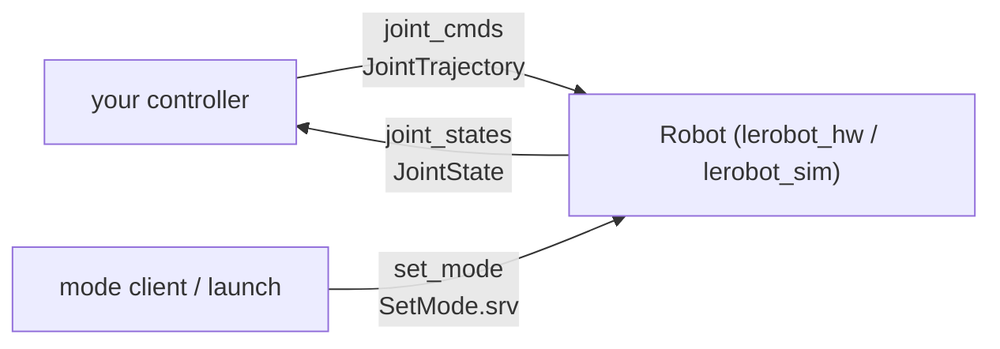

# ROS interface (`robot_core`)

Back to [Home](Home.md)

This is the **contract** between your controllers and the robot. Every robot node
([`lerobot_hw`](lerobot-nodes.md#lerobot_hw---real-hardware-driver) and
[`lerobot_sim`](lerobot-nodes.md#lerobot_sim---simulation-node)) inherits from the
abstract `Robot` base class in [`robot_core`](../ros_ws/src/robot_core), so they
all expose the same topics and service. If you write a controller against this
interface, it works on both the real robot and the simulation.

Key files:

- [`include/robot_core/robot.hpp`](../ros_ws/src/robot_core/include/robot_core/robot.hpp) - the `Robot` class.
- [`src/robot.cpp`](../ros_ws/src/robot_core/src/robot.cpp) - the ROS wiring and command handling.
- [`srv/SetMode.srv`](../ros_ws/src/robot_core/srv/SetMode.srv) - the mode-switch service.

## The `Robot` base class

`Robot` is an `rclcpp::Node` that owns all the ROS graph wiring and routes
incoming commands to pure-virtual actuation methods that the hardware/sim
subclasses implement (e.g. `set_des_q_rad`, `set_des_qdot_rad`,
`set_des_gripper`). Subclasses override the actuation and sensing; the base class
handles the topics, the service, and the periodic state publishing.

## The three endpoints



| Direction | Name | Type | Used by example controllers? |
|-----------|------|------|-------------------------------|
| Controller -> Robot | `joint_cmds` (param `sub_topic`) | `trajectory_msgs/JointTrajectory` | Yes (publish) |
| Robot -> world | `joint_states` (param `pub_topic`) | `sensor_msgs/JointState` | No (available for feedback) |
| Client -> Robot | `set_mode` | `robot_core/srv/SetMode` | No (usually set at launch) |

## Command topic: `joint_cmds`

- **Type:** `trajectory_msgs/msg/JointTrajectory`
- The robot uses **only the first trajectory point** (`points[0]`); it is treated
  as the single desired set-point.
- The robot interprets the point according to its current **mode**:

| Field | Position mode | Velocity mode |
|-------|---------------|---------------|
| `points[0].positions` | **Required** - absolute joint angles in **radians** | Ignored |
| `points[0].velocities` | Ignored | **Required** - joint speeds in **rad/s** |
| Optional extra (6th) element | Gripper opening, normalized `0.0` = closed, `1.0` = open | Gripper opening velocity |

- The arm has **`n = 5`** joints; the gripper is the optional 6th channel.
- Commands with too few values are rejected (a message is printed to stdout).

### Joint order

The 5 arm joints (plus the gripper as the 6th channel) are, in order:

```
Shoulder_Rotation, Shoulder_Pitch, Elbow, Wrist_Pitch, Wrist_Roll, Gripper
```

These names match the [URDF model](simulation-and-visualization.md#urdf-model).

## State topic: `joint_states`

- **Type:** `sensor_msgs/msg/JointState`
- **Rate:** default **100 Hz** (parameter `f`).
- Published fields: `name`, `header.stamp`, `position`, `velocity`, and optionally
  `effort` (motor current on hardware).

Subscribe to this topic if you want closed-loop control. The example controllers
are open-loop and do not subscribe to it.

## Mode service: `set_mode`

- **Type:** `robot_core/srv/SetMode`
- **Definition:**

```
string mode
---
bool success
```

- **Request:** `mode` is `"position"` or `"velocity"` (case-insensitive).

In practice the mode is usually selected at launch time rather than via the
service:

- `ros2 launch lerobot hw_position.launch.py` / `sim_position.launch.py` -> position
- `ros2 launch lerobot hw_velocity.launch.py` / `sim_velocity.launch.py` -> velocity

## Base parameters

These are declared by `Robot` and can be set in the YAML config (see
[Configuration](configuration.md)):

| Parameter | Default | Meaning |
|-----------|---------|---------|
| `f` | `100.0` | Joint-state publish rate (Hz) |
| `pub_topic` | `"joint_states"` | Output topic name |
| `sub_topic` | `"joint_cmds"` | Command topic name |
| `vel_sub_topic` | `"joint_vel_cmds"` | Declared but **not used** - both modes share `joint_cmds` |
| `mode` | `"position"` | `"position"` or `"velocity"` |

> Note: `vel_sub_topic` is declared in the code but never wired up; velocity
> commands arrive on the same `joint_cmds` topic.

## See also

- [Writing controllers](writing-controllers.md) - apply this contract in C++ and Python.
- [LeRobot nodes](lerobot-nodes.md) - the concrete nodes that implement it.
- [Architecture](architecture.md) - where this layer sits in the stack.
