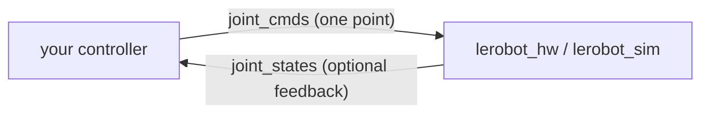

# Writing controllers

Back to [Home](Home.md)

A controller is just a ROS 2 node that publishes commands on `joint_cmds` and
(optionally) subscribes to `joint_states`. The robot/sim node interprets the
commands according to its mode. Read the [ROS interface](ros-interface.md) page
first - it defines the exact contract (message type, joint order, units, gripper
channel) that the examples below follow.

You can write controllers in C++ ([`controllers`](../ros_ws/src/controllers)) or
Python ([`python_controllers`](../ros_ws/src/python_controllers)); the examples
ship in both.

## Workflow

1. Start a robot backend in the mode you want, e.g.
   `ros2 launch lerobot sim_position.launch.py` (or `hw_velocity`, etc.).
2. Match your controller to that mode (positions vs velocities).
3. Run your controller; it publishes one `JointTrajectoryPoint` per tick on
   `joint_cmds`.
4. Optionally subscribe to `joint_states` for closed-loop control (the examples
   are open-loop).



## C++ example controllers

Files:
[`src/example_pos_traj.cpp`](../ros_ws/src/controllers/src/example_pos_traj.cpp),
[`src/example_vel_traj.cpp`](../ros_ws/src/controllers/src/example_vel_traj.cpp),
headers in [`include/controllers`](../ros_ws/src/controllers/include/controllers).

**`example_pos_traj`** (position) publishes a single-point position set-point on a
timer (~25 Hz). The joint angles are a sinusoidal offset around a configurable
`home` pose, plus a gripper opening in `[0, 1]`:

```cpp
this->_publisher = this->create_publisher<trajectory_msgs::msg::JointTrajectory>("joint_cmds", qos);
// ...
auto point = trajectory_msgs::msg::JointTrajectoryPoint();
point.positions = { home[0] + s, home[1] - 0.25*M_PI + s, /* ... */, g };
msg.points = {point};
this->_publisher->publish(msg);
```

**`example_vel_traj`** (velocity) publishes joint velocities instead of positions
on a ~13 Hz timer:

```cpp
point.velocities = velocities;   // 5 joint speeds + gripper speed
msg.points = {point};
this->_publisher->publish(msg);
```

Both publish the **same topic and message type**; only the populated field
(`positions` vs `velocities`) differs, and the robot's mode decides which one is
used.

Run them with:

```bash
ros2 run controllers example_pos_traj
ros2 run controllers example_vel_traj
```

### Adding a new C++ controller

1. Add a header `include/controllers/my_controller.hpp` declaring a class that
   subclasses `rclcpp::Node` with a publisher + timer (copy the pattern from an
   existing header).
2. Add `src/my_controller.cpp`:
   - In the constructor: declare parameters, create a publisher on `"joint_cmds"`,
     create a wall timer.
   - In the timer callback: build a `JointTrajectory` with **one**
     `JointTrajectoryPoint` (fill `positions` or `velocities`), then publish.
   - In `main()`: `rclcpp::init` -> `spin(std::make_shared<MyController>())` ->
     `rclcpp::shutdown`.
3. Register the target in
   [`CMakeLists.txt`](../ros_ws/src/controllers/CMakeLists.txt), mirroring the
   existing entries:

```cmake
add_executable(my_controller src/my_controller.cpp)
ament_target_dependencies(my_controller rclcpp trajectory_msgs)
target_include_directories(my_controller PUBLIC
  $<BUILD_INTERFACE:${CMAKE_CURRENT_SOURCE_DIR}/include/controllers>
  $<INSTALL_INTERFACE:include>)
install(TARGETS my_controller DESTINATION lib/${PROJECT_NAME})
```

4. `colcon build` -> `source install/setup.bash` -> `ros2 run controllers my_controller`.

## Python example controllers

Files:
[`example_pos_traj.py`](../ros_ws/src/python_controllers/python_controllers/example_pos_traj.py),
[`example_vel_traj.py`](../ros_ws/src/python_controllers/python_controllers/example_vel_traj.py).

The Python examples mirror the C++ ones: subclass `rclpy.node.Node`, publish a
`JointTrajectory` on `joint_cmds`, no subscriptions.

```python
self._publisher = self.create_publisher(JointTrajectory, 'joint_cmds', 10)
timer_period = 0.04  # seconds
self._timer = self.create_timer(timer_period, self.timer_callback)
# ...
point = JointTrajectoryPoint()
point.positions = [ ... ]          # or point.velocities = [ ... ]
msg.points = [point]
self._publisher.publish(msg)
```

Nodes are exposed as console scripts via `entry_points` in
[`setup.py`](../ros_ws/src/python_controllers/setup.py):

```python
entry_points={
    'console_scripts': [
        'example_pos_traj = python_controllers.example_pos_traj:main',
        'example_vel_traj = python_controllers.example_vel_traj:main',
    ],
},
```

### Adding a new Python controller

1. Add `python_controllers/my_controller.py` with a `class MyController(Node)`
   and a `main()` that calls `rclpy.init()`, instantiates the node, and
   `rclpy.spin()`.
2. Register it in `setup.py`:

```python
'my_controller = python_controllers.my_controller:main',
```

3. `colcon build` -> `ros2 run python_controllers my_controller`.

## Caveats

- [`CMakeLists.txt`](../ros_ws/src/controllers/CMakeLists.txt) builds
  `example_pos_traj` and `example_vel_traj`, but
  [`launch/lerobot_controller.launch.py`](../ros_ws/src/controllers/launch/lerobot_controller.launch.py)
  references an `example_traj` executable that no longer exists, so prefer running
  the examples directly with `ros2 run` as shown above.
- The `lerobot_params.yaml` namespace (`example_traj_lerobot`) does not match the
  node names the examples register, so the `home` parameter from that file is not
  applied when running via `ros2 run` (the in-code default is used). See
  [Configuration](configuration.md#lerobot_paramsyaml-example-controller).

## `testing/` folder

The top-level [`testing/`](../testing) folder holds **non-ROS** hardware
smoke-tests, useful for verifying the bus before involving ROS:

- [`serial_test.py`](../testing/serial_test.py) - sends a raw serial command to a
  single servo at 9600 baud to confirm USB/serial connectivity.
- [`test.cpp`](../testing/test.cpp) - exercises a legacy standalone C++ `Robot`
  class (from a submodule under `cpp_impl/`) to move to joint angles in degrees
  and open/close the gripper, built via `build.sh`.

These are independent of the ROS workspace and are not built by `colcon`.
